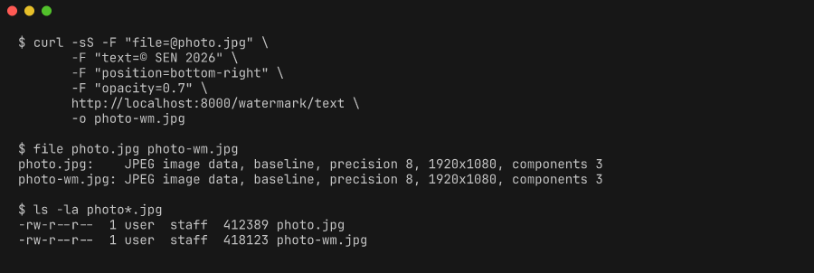

# watermark-api

A small **FastAPI** service that adds text or image watermarks to uploaded photos using **Pillow**. Two endpoints, format-preserving, no JVM, no ImageMagick, no 400 MB container.

```bash
git clone https://github.com/sen-ltd/watermark-api
cd watermark-api

docker build -t watermark-api .
docker run --rm -p 8000:8000 watermark-api

# In another shell
curl -F "file=@photo.jpg" \
     -F "text=© SEN 2026" \
     -F "position=bottom-right" \
     -F "opacity=0.6" \
     http://localhost:8000/watermark/text -o photo-wm.jpg
```



## Why this exists

Image watermarking is a common need for photography sites, marketplaces, document workflows, and preview pipelines — and almost always ends up in one of three unhappy places:

- **Inline in the app.** Pillow code in your Rails/Django/Express handlers. Fast to ship, then it becomes the tech-debt magnet nobody wants to touch.
- **A SaaS image API.** Pay per request, learn their DSL, accept their latency. Massive overkill for a single operation you fully understand.
- **`imagemagick` shelling out.** A classic. Works until you need to composite alpha cleanly, or until the CVE list gets uncomfortable.

`watermark-api` is a ~110 MB Alpine image built around [Pillow](https://python-pillow.org/). Two endpoints, FastAPI-generated OpenAPI, format preservation as a service contract, and DejaVu bundled so text watermarks just work. Deploy it behind your existing reverse proxy, point your app at it, and forget it exists.

## Endpoints

| Method | Path | Purpose |
|--------|------|---------|
| `GET`  | `/` | Minimal HTML landing page with a curl example |
| `GET`  | `/health` | Liveness probe: `{"status":"ok","version":"..."}` |
| `POST` | `/watermark/text` | Multipart upload, overlays a text string |
| `POST` | `/watermark/image` | Multipart upload, overlays a PNG with alpha |
| `GET`  | `/docs` | FastAPI Swagger UI |
| `GET`  | `/openapi.json` | OpenAPI 3 spec |

### `POST /watermark/text`

| Field | Required | Default | Description |
|-------|----------|---------|-------------|
| `file` | yes | — | Input image: JPEG, PNG, or WebP |
| `text` | yes | — | Watermark text, max 200 chars |
| `position` | no | `bottom-right` | `top-left` / `top-right` / `bottom-left` / `bottom-right` / `center` |
| `opacity` | no | `0.5` | 0.0–1.0 |
| `color` | no | `#ffffff` | Hex `#RRGGBB` |
| `font_size_pct` | no | `3` | Font height as % of image height, 1–20 |
| `padding_pct` | no | `2` | Edge padding as % of min dimension, 0–20 |

Returns the watermarked image as a binary body with the original content type.

### `POST /watermark/image`

Same as above but with an `overlay` file field (PNG with alpha) instead of `text`. Additional fields: `overlay_pct` (1–50, default 20, controls the overlay's width as a percentage of the base image's width).

## Format preservation

Input format determines output format:

| In | Out | Settings |
|----|-----|----------|
| JPEG | JPEG | quality 90, baseline |
| PNG  | PNG  | default |
| WebP | WebP | lossless |

Content-type is detected by **magic bytes**, not the client-reported MIME. A client lying about a `Content-Type` header can't sneak a text file through the guard.

## Error responses

Every error returns JSON shaped `{"error": "code", "detail": "human message"}`:

| Status | Code | When |
|--------|------|------|
| 413 | `payload_too_large` | Upload exceeds `MAX_UPLOAD_MB` (default 10) |
| 415 | `unsupported_media_type` | Bytes don't match JPEG/PNG/WebP magic, or overlay isn't PNG |
| 422 | `invalid_position` | `position` is not one of the five allowed values |
| 422 | `invalid_color` | `color` is not in `#RRGGBB` form |
| 422 | `unprocessable_image` | Pillow refuses to decode the payload |
| 422 | (FastAPI default) | Missing required field, or numeric field out of range |

## Configuration

| Env var | Default | Meaning |
|---------|---------|---------|
| `HOST` | `0.0.0.0` | Bind address |
| `PORT` | `8000` | Bind port |
| `MAX_UPLOAD_MB` | `10` | Reject uploads over this size with 413 |

## Why Pillow over ImageMagick / Wand

- **Smaller image.** Pillow + Alpine runtime libs comes in around 110 MB. An ImageMagick-based image starts over 200 MB and has a longer CVE history.
- **No shellouts.** Alpha compositing stays in a single process; no `/tmp` files, no argument escaping footguns.
- **Everything we need, nothing we don't.** JPEG/PNG/WebP codecs, TrueType rendering, alpha compositing — all in one dependency.
- **The "hard bits" are actually easy.** Pillow's `Image.alpha_composite` does the alpha-correct blend we want, and `ImageDraw.textbbox` gives us accurate measurement for positioning.

## Limitations (read before you ship)

- **No GIF, no TIFF, no HEIF.** The guard explicitly allows JPEG/PNG/WebP and nothing else. Those are the formats photography workflows actually use. Adding another is a one-liner in `validators.py` — but do it deliberately, not by accident.
- **No bidi / RTL text shaping.** Pillow's text rendering is left-to-right. Hebrew and Arabic watermarks come out visually backwards. If you need that, wrap the text through `python-bidi` and `arabic-reshaper` upstream.
- **Long text doesn't wrap.** Pick shorter text, or a smaller `font_size_pct`, or do your own wrapping before calling. Watermarks are captions, not essays.
- **No font choice at runtime.** The service uses DejaVu Sans and nothing else. That's intentional — "bring your own font" turns a 50-line API into a config nightmare.

## Development

```bash
python -m venv .venv && source .venv/bin/activate
pip install -e ".[dev]"
pytest -q
uvicorn watermark_api.main:app --reload
```

### Running tests inside the Docker image

```bash
docker run --rm --entrypoint pytest watermark-api -q
```

The test suite generates its JPEG/PNG/WebP fixtures in memory via Pillow. No binary files are committed.

## License

MIT. See [LICENSE](./LICENSE).
